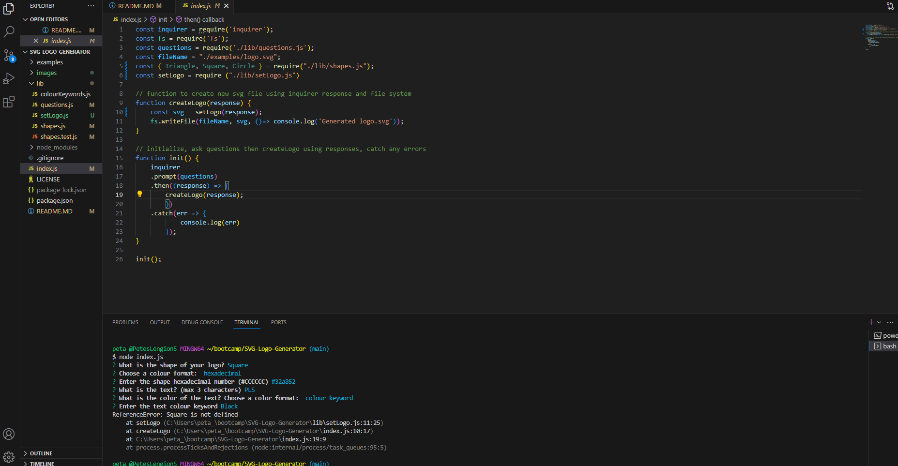
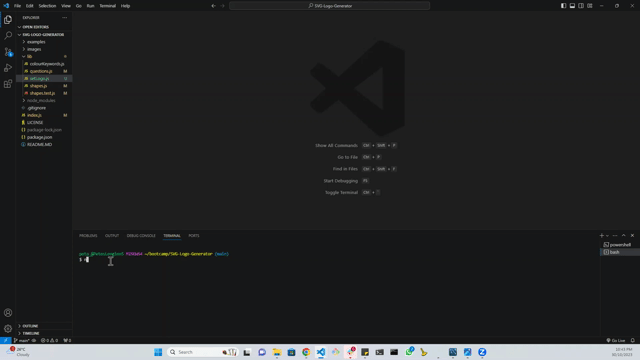

# SVG-Logo-Generator

  

  ## Description
  The aim of the challenge was to build a Node.js command-line application that takes user inputs to generate a custom logo and save it as an SVG file. The user would be prompted to select:  Colour (bg & text), Shape (Triangle, Square, Circle) and text (1-3 letters).

  ## Table of Contents
  * [Description](#description)
  * [Installation](#installation)
  * [Usage](#usage)
  * [Licenses](#licenses)
  * [Contributing](#how-to-contribute)
  * [Tests](#tests)
  * [Questions/Contact Info](#questionscontacts)
  * [Credits](#credits)

  ## Installation
  The user should clone the code from this GitHub repository and download Node. This application also requires VScode (or similar), a file system, inquirer and jest modules.

  ## Usage
  Screenshots and a video demonstration of the incomplete application are below. There's also a copy of the full video in Images.
   
     
    [Link to Video demonstration on Google Drive] (https://drive.google.com/file/d/1_idF58HG0lznjjPWP6ctciCGJawhth9a/view)

  ## Licenses
  This project is covered under the MIT license.
  To learn more about what this means, click the license button at the top.

  ## How to contribute
  Please get in touch via the details below to discuss third party contributions.

  ## Tests
  N/A

  ## Questions/Contacts
  Have questions about this project?  
  GitHub: https://github.com/Petarlo  
  Email: petaswan986@gmail.com

  ## Credits
  N/A
